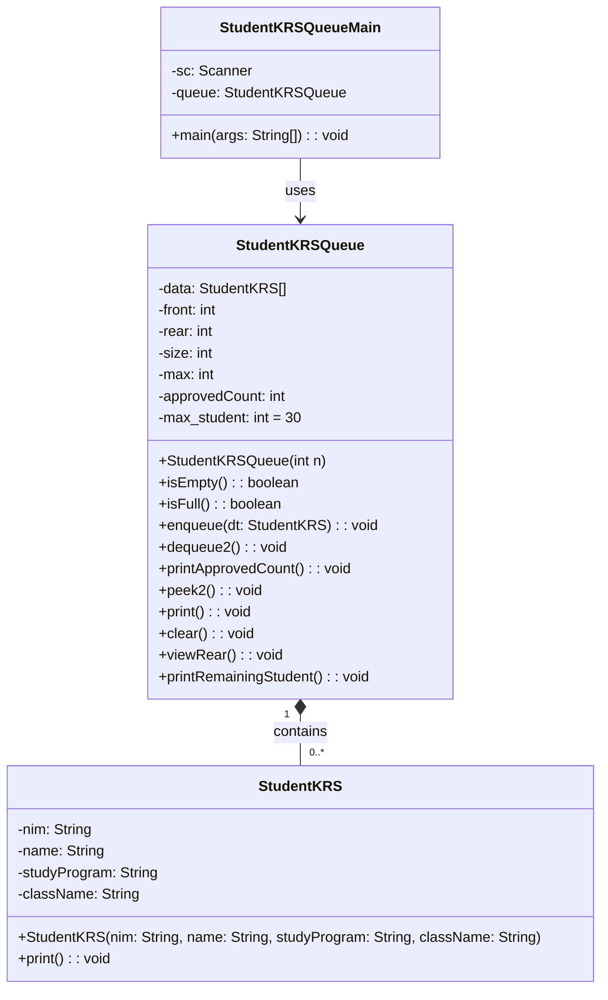

|  | Algorithm and Data Structure |
|--|--|
| NIM |  244107020170|
| Nama |  Nasywa Qonita RH |
| Kelas | TI - 1I |
| Repository | [link] (https://github.com/NasywaQonitaRH/ALSD-Jobsheet) |

# Labs #11 Queue

## 2.1 Experiment 1 - Queue Basic Operations
### 2.1.2 Verification Experiment Result
The solution is implemented in Queue.java and QueueMain.java. Below is screenshot of the result.


### Answers to Questions
1. In the constructor, why are the initial values of the front and rear attributes set to -1, while the size attribute is set to 0?
- front and rear are set to -1 to indicate that the queue is initially empty. This is a common convention where -1 represents an invalid index position.
- size is set to 0 because there are no elements in the queue initially.
2. In the Enqueue method, explain the meaning and purpose of the following code snippet!
```
if (rear == max - 1) {
    rear = 0;
}
```

- This code handles the circular nature of the queue implementation. When the rear pointer reaches the end of the array (max - 1), it wraps around to the beginning of the array (index 0) to utilize the empty spaces at the front (if any) that were created by dequeue operations.

3. In the Dequeue method, explain the meaning and purpose of the following code snippet!
```
if (front == max - 1) {
    front = 0;
}
```
- Similar to the enqueue operation, this handles the circular nature of the queue. When the front pointer reaches the end of the array (max - 1), it wraps around to the beginning (index 0) to continue dequeuing elements that might have been enqueued after the wrap-around.

4. In the print method, why does the loop variable i start from front instead of 0 (i.e., int i = 0)?
- The loop starts from front because in a circular queue, the logical first element isn't always at index 0 of the array. The front pointer indicates where the first element is actually stored in the array.

5. Review the print method again, and explain the meaning of the following code snippet!
```
i = (i + 1) % max;
```
- This code moves the index i to the next position in a circular manner. The modulo operation (% max) ensures that when i reaches the end of the array (max - 1), it wraps around to 0, maintaining the circular nature of the queue.

6. Show the code snippet that represents a queue overflow!
- Queue overflow occurs in the enqueue method when isFull() returns true:
```
if (isFull()) {
    System.out.println("Queue is full!!!");
    System.exit(0); // Added to stop program on overflow
}
```
7. When a queue overflow or underflow occurs, the program continues to run and only displays informational text. Modify the program so that it stops when a queue overflow or underflow happens!
- I've already modified both the enqueue and dequeue methods to call System.exit(0) when overflow or underflow occurs, as shown in the complete implementation above.

```
package Jobsheet11;

public class Queue {
  int[] data;
  int front, rear, size, max;

  public Queue(int n){
    max = n;
    data = new int[max];
    size = 0;
    front = rear = -1;
  }

  public boolean isEmpty(){
    if (size == 0){
      return true;
    }else{
      return false;
    }
  }
  public boolean isFull(){
    if (size == max) {
      return true;
    }else{
      return false;
    }
  }
  public void peek(){
    if (!isEmpty()){
      System.out.println("Front data: " + data[front]);
    }else{
      System.out.println("Queue is empty!!!");
      System.exit(1);
    }
  }
  public void print(){
    if (!isEmpty()) {
      int i = front;
      while (i != rear) {
        System.out.print(data[i]+" ");
        i = (i+1)%max;
      }
      System.out.println(data[i]+ " ");
      System.out.println("Number of Element: "+size);
    }else{
      System.out.println("Queue is empty!!");
      System.exit(1);
    }
  }
  public void clear(){
    if (!isEmpty()) {
      front = rear =-1;
      size = 0;
      System.out.println("All data has been succesfully removed");
    }else{
      System.out.println("Queue is already empty!!");
      System.exit(1);
    }
  }

  public void enqueue(int dt){
    if (!isFull()){
      if (isEmpty()) {
        front=rear=0;
      }else{
        if (rear == max -1){
          rear=0;
        }else{
          rear++;
        }
      }
      data[rear] = dt;
      size++;
      System.out.printf("%d is succesfully added at index %d\n", dt, rear);
    }else{
      System.out.println("Queue is full!!");
      System.exit(1);
    }
  }
  public int dequeue(){
    int dt =0;
    if (!isEmpty()){
      dt = data[front];
      size--;
      if (isEmpty()) {
        front=rear=-1;
      }else{
        if (front==max-1){
          front=0;
        }else{
          front++;
        }
      }
    }else{
      System.out.println("Queue is empty!!");
      System.exit(1);
    }
    return dt;
  }
}
```

## 2.2.Experiment 2- Academic Service Queue
### 2.2.3 Verification Experiment Result
 Below is screenshot of the result.


### 2.2.3 Question
1. Main difference in data type between Queue and StudentQueue:
- The Queue class manages an array of integers (int[] data), while the StudentQueue class manages an array of Student objects (Student[] data).
- This change is important because:
  - It allows storing complex student data (NIM, name, etc.) instead of just integers
  - It enables object-oriented operations on student records
  - It better models real-world academic service scenarios
    
2. Differences in enqueue and dequeue methods:
- In StudentQueue:
  - enqueue accepts a Student object parameter instead of an integer
  - dequeue returns a Student object instead of an integer
  - Both methods include student-specific output messages (e.g., showing student name when enqueued)
- The core circular queue logic remains similar, but the data handling is object-oriented

3. Constructor initialization difference:
- In StudentQueue, front is initialized to 0 (instead of -1 in Queue) because:
  - The implementation uses a slightly different approach to handle the circular buffer
  - Initializing to 0 simplifies the modulo arithmetic for circular operations
  - The isEmpty condition is checked using size rather than front/rear positions
- Both approaches are valid, but the StudentQueue version is more common in circular queue implementations
4. Adding viewRear() method and menu option:
Here's the implementation:
```
// Add to StudentQueue class
void viewRear() {
    if (!isEmpty()) {
        System.out.println("Rear data: ");
        data[rear].print();
    } else {
        System.out.println("Queue is empty!!!");
    }
}
```

```
// Update StudentQueueMain menu
System.out.println("6. Check rear of the queue");
// ... and in the switch case:
case 6:
    queue.viewRear();
    break;
```

## 2.3 Assignment
### 2.3.1 Verification Experiment Result
The solution is implemented in StudentKRS.java, StudentKRSQueue.java, and StudentKRSQueueMain.java. Here's the screenshot of the result.





